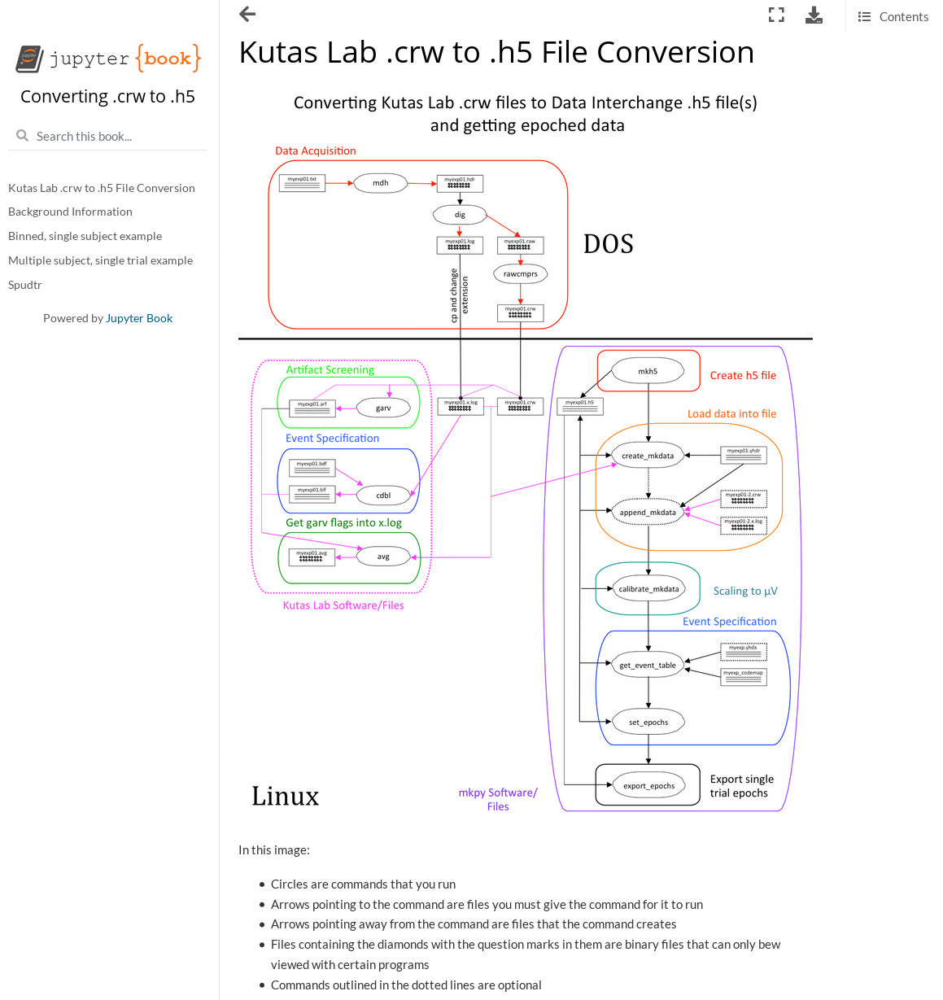

.. _as_gists:

A. Stoermann's Gists online
---------------------------

This jupyter book shows how to analyze Kutas lab EEG data nose-to-tail
from .crw/.log files through HDF5 conversion, event code tagging, and
exporting EEG data for analysis.

https://eeg-workshops.github.io/mkpy_pipeline_gists/intro.html

