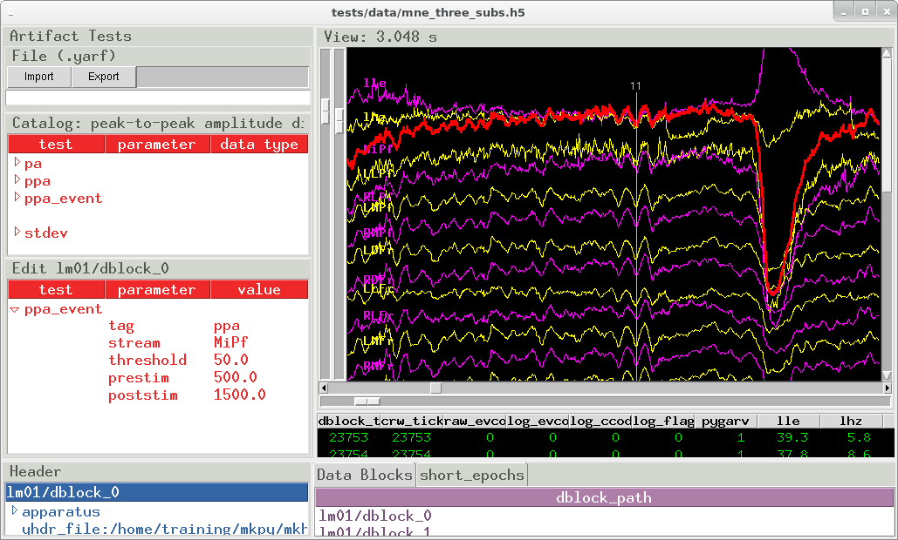

pygarv: EEG visualization dashboard
====================================

``pygarv`` is a command line utility that integrates EEG data
visualization with an EEG artifact screening test editor. 

.. _pygarv_all_views:

Panel dividers slide to hide or show the different views:

* :ref:`pygarv_traces`
* :ref:`pygarv_data_table`
* :ref:`pygarv_header`
* :ref:`pygarv_dblocks`
* :ref:`pygarv_epochs`
* :ref:`pygarv_artifact_tests`

.. _pygarv_traces:

EEG waveforms
--------------

.. figure:: _images/viewer_trace_view.png
   :scale: 75 %
   :alt: pygarv_traces
   
   EEG trace panel

.. _pygarv_data_table:

EEG Data table
---------------

   Data table panel

.. _pygarv_header:

Header 
--------

   Header data panel

.. _pygarv_dblocks:

Datablock directory
-------------------------

.. figure:: _images/viewer_dblock_path_view.png
   :scale: 75 %
   :alt: pygarv_data_blocks

   HDF5 data groups

.. _pygarv_epochs:

Tagged events and epochs 
-------------------------

   Epochs and experimental event tags

.. _pygarv_artifact_tests:

EEG artifact screening test editor
-----------------------------------

.. figure:: _images/viewer_pygarv_view.png
   :scale: 75 %
   :alt: pygarv_artifact_tests

   Artifact screening tests

EEG artifacts in `mkh5` files are tagged and tracked not deleted. A
dedicated ``pygarv`` 64-bit integer column alongside the EEG and event
codes is default 0 (== good) at every data block sample. A sequence of
user-specified Go-No-Go artifact tests is read from a YAML format text
file, stored in the data block header, and the tests swept across the
data. At samples where the *n* -th test fails, bit *n* of the
``pygarv`` integer is set high. Any non-zero value in the ``pygarv``
column indcates an artifact and the integer value can be decoded into
the indexes of the failed tests.  In combination with the test
specifications stored in the header this can be use to reconstruct
exactly which tests failed at each sample. Since the pygarv column
travels with the EEG data, the artifact status of every data point is
available during subsequent analysis.

To streamline the EEG screening process, the pygarv dashboard
integrates a test editor that can import, edit, visualize, and export
the YAML files.  This is a convenience, the YAML files can be generated
programmatically or typed and edited by hand.

